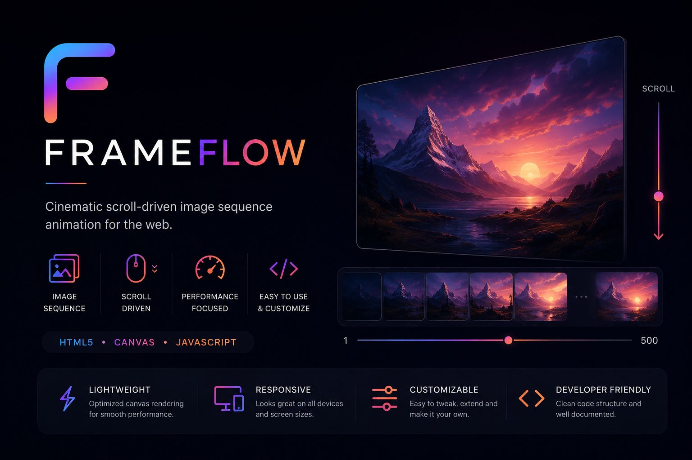

# <p align="center">

</p>

<h1 align="center">FrameFlow</h1>

<p align="center">
Cinematic Scroll-Driven Image Sequence Engine built using HTML5 Canvas and JavaScript.
</p>

<p align="center">


</p>

---

## ✨ About

FrameFlow is a lightweight JavaScript engine that creates cinematic scroll-driven animations using an image sequence rendered on an HTML5 Canvas.

Instead of playing a traditional video, FrameFlow synchronizes the user's scroll position with a sequence of rendered frames, creating a premium interactive experience similar to modern product landing pages.

---

## 🚀 Features

- 🎬 Smooth scroll-driven animation
- 🖼 Image sequence rendering
- ⚡ HTML5 Canvas powered
- 📱 Responsive layout
- 🚀 Optimized rendering pipeline
- 🧩 Easy to customize
- 🎨 Clean project architecture
- 🌙 Modern minimal UI

---

## 📸 Preview

<p align="center">


</p>

---

## 🛠 Tech Stack

- HTML5
- CSS3
- JavaScript (ES6)
- HTML5 Canvas

---

## 📂 Project Structure

```text
FrameFlow/

│── assets/
│   ├── banner.png
│   └── demo.gif
│
│── frames/
│   ├── 0001.webp
│   ├── 0002.webp
│   └── ...
│
│── index.html
│── style.css
│── script.js
│
├── README.md
└── LICENSE
```

---

## ⚙️ Installation

Clone the repository.

```bash
git clone https://github.com/Tejwardeep-Singh/FrameFlow.git
```

Move into the project.

```bash
cd FrameFlow
```

Open `index.html` using Live Server or any local development server.

---

## 📖 How It Works

```text
Scroll

↓

Calculate Scroll Percentage

↓

Convert Percentage to Frame Index

↓

Load Corresponding Image

↓

Render on Canvas

↓

Smooth Scroll Animation
```

---

## 📅 Roadmap

- [ ] Image preloading optimization
- [ ] Lazy loading support
- [ ] Mobile optimization
- [ ] Retina display support
- [ ] GSAP integration
- [ ] Multiple image sequences
- [ ] Camera transition support
- [ ] ScrollTrigger integration
- [ ] NPM package release

---

## 🤝 Contributing

Contributions are welcome.

If you'd like to improve FrameFlow, feel free to fork the repository and submit a Pull Request.

---

## 📄 License

This project is licensed under the MIT License.

See the LICENSE file for details.

---

## 👨‍💻 Author

**Tejwardeep Singh**

Student Developer • Full Stack Web Developer • Unity Developer

GitHub

https://github.com/Tejwardeep-Singh

---

<p align="center">
Made with ❤️ using HTML5 Canvas
</p>